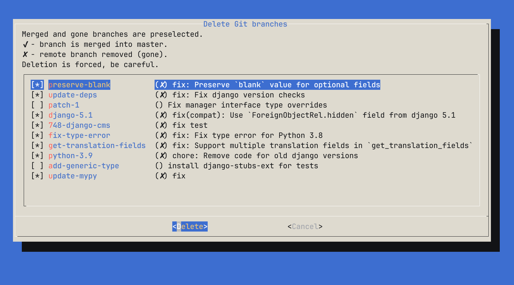

# git-remove-branch

Script to select and remove git branches



1. Move to `~/.local/bin` or whatever dir you're using for executable scripts.
2. You can use it as is, or add this to your git config and use as `git remove-branch`:

```
[alias]
	remove-branch = "!git-remove-branch"
```
